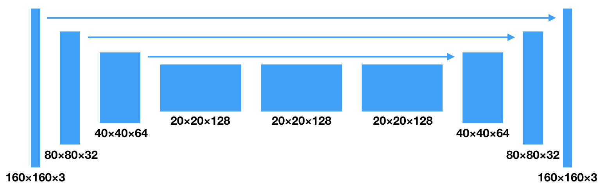
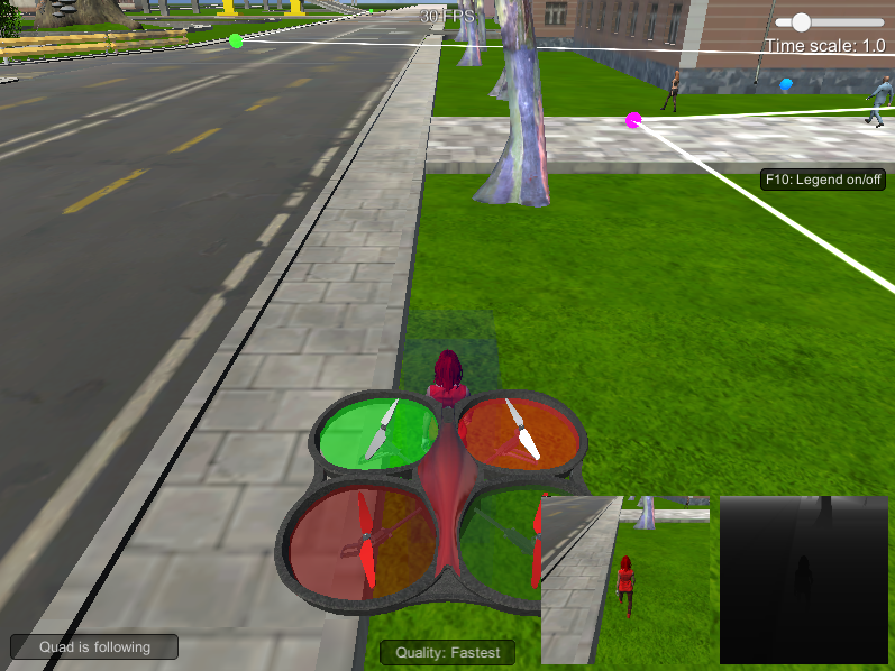

# **Follow Me**

[](https://www.udacity.com/robotics)

## Overview

In this project, you will train a deep neural network to identify and track a target in simulation. So-called “follow me” applications like this are key to many fields of robotics and the very same techniques you apply here could be extended to scenarios like advanced cruise control in autonomous vehicles or human-robot collaboration in industry.

## Project Details

### Network Architecture

#### FCN

<div></div>

FCN (Fully Convolutional Network) is adopted for this segmentation task. The architecture is depicted above. It consists of a encoder and a decoder and makes use of 1×1 convolutions. The architecture is inspired by U-Net which makes use of skip connections.

<div></div>

#### Encoder and Decoder

The encoder consists of several convolutional layers for extracting useful information which can be used later for decoder, while reducing the resolution of the data.

The decoder consists of several deconvolutional layers or upsampling layers for transforming the downsampled data back to the original resolution for segmentation prediction. Sometimes, in the middle of the decoder, the features from one decoder layer and the ones from one encoder layer are concatenated through the skip connections.

There is a drawback. even though encoder works as feature extraction by reducing spatial information (losing unimportant information), sometimes decoder can struggle to recover this spatial information (back to full resolution). One solution is actually skip connection though!

#### 1×1 Convolution and Fully Connected Layer

1x1 convolution is a convolution which uses a kernel and stride of 1. 1x1 convolution allows the network to be able to retain spatial information from the encoder so it best suits for segmentation task. In contrast, fully connected layer, which is often used at the end of the network to output class prediction in the context of classification task, flattens the input dimensions so it loses spatial information.

In the architecture shown above, 1×1 convolutions are used for separable convolutions and a intermediate layer. This can reduce the number of parameters and hence avoid overfitting.

<div></div>

### Hyperparameters

```
learning_rate = 0.002
batch_size = 32
num_epochs = 30
steps_per_epoch = 200
validation_steps = 50
workers = 2
```

Hyperparameters used for training are manual tuned. For batch size, I often see one use 32 so I just use that. For epoch and learning rate, I carefully check the training progress in order not to be overfitting or underfitting and I choose the numbers.

### Results

<div></div>

The quad successfully follows the target!

### Limitations and Future Works

If you want to follow/identify other than human, such as dog or car, you have to collect data for those objects and train a model again from scratch.

Also, I noticed that the model struggles to identify target / human from far away (high false negative rate).
One future work can be making the model deeper/bigger so that it can give the model power to identify small objects in the scene. On top of that, I can also try transfer learning  (maybe ImageNet pretrained?) for encoder so it can mitigate the effect of lack of a lot of data (underfitting).

And as always, go get more training data!
